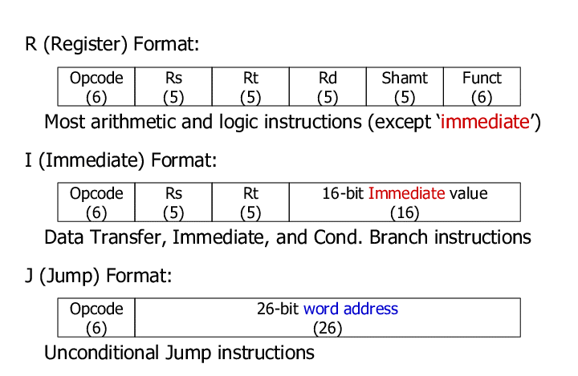
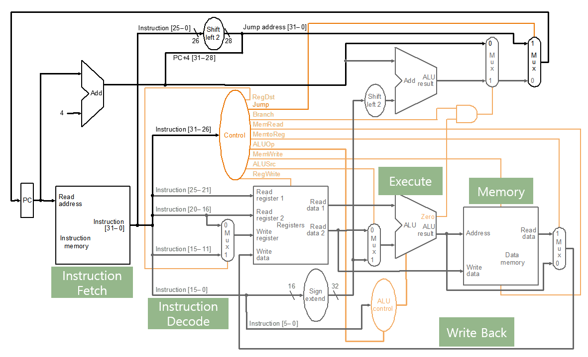

# computer-architecture

## simple_calculator
  * simple calculator that performs operations according to commands from ISA  
    
       The below is the sample input file.  
         
          + 0x1A 4  
           M R2 R0  
           M R1 0x2  
           C 3 2  
           B 14  
           / R2 R1  
           M R1 R0  
           G 8 6  
           M R1 R0  
           - 7 4  
           M R2 R0  
           C 2 3  
           J 5   
           H  
             
## single_cycle
 * Computer consists of memory and CPU, and there are various commands.
 * The commands used in the architecture of the Microprocessor without Interlocked Pipeline Stages (MIPS) are implemented and executed according to the following steps.
   1. Instruction fetch  
   
          the construction is fetched from the Instruction Memory that the PC points to.
          
   2. Instruction decode  
          
          Each MIPS instruction is 32 bits and the instruction of binary number is decoded to determine the operation.  
          There are three formats: R, I and J. The decode menthod is slightly different for each format.
         
          
   3. Execute  
   
          ALU performs the poeration determined in the previous step.
          
   4. Memory access  
   
          If opcode is SW or LW, obtain the value from memory or store the value in memory.
          
   5. Write back  
     
          Operation result is updated to the register.
          
 * these stages are executed in a single cycle.
 * The below is datapath that shows a series of process in single cycle, containing all five steps. Control logic adjusts control signal to determine whether each stage performs the operation or not.  
 
     
     
## pipeline

