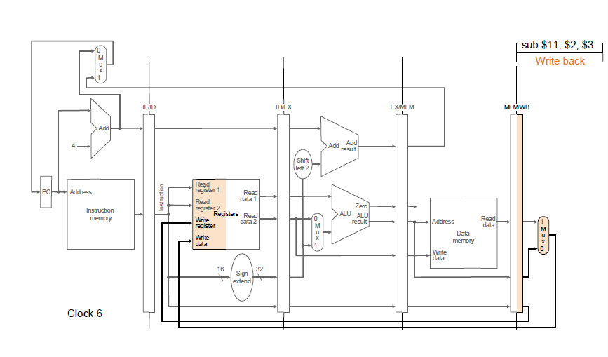
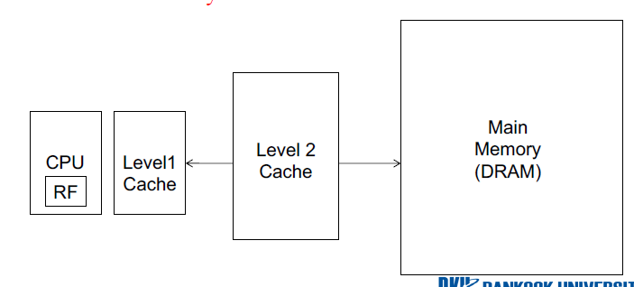

# computer-architecture

## simple_calculator
  * simple calculator that performs operations according to commands from ISA  
    
       The below is the sample input file.  
         
          + 0x1A 4  
           M R2 R0  
           M R1 0x2  
           C 3 2  
           B 14  
           / R2 R1  
           M R1 R0  
           G 8 6  
           M R1 R0  
           - 7 4  
           M R2 R0  
           C 2 3  
           J 5   
           H  
             
## single_cycle
 * Computer consists of memory and CPU, and there are various commands.
 * The commands used in the architecture of the Microprocessor without Interlocked Pipeline Stages (MIPS) are implemented and executed according to the following steps.
   1. Instruction fetch  
   
          the construction is fetched from the Instruction Memory that the PC points to.
          
   2. Instruction decode  
          
          Each MIPS instruction is 32 bits and the instruction of binary number is decoded to determine the operation.  
          There are three formats: R, I and J. The decode menthod is slightly different for each format.
         
          
   3. Execute  
   
          ALU performs the poeration determined in the previous step.
          
   4. Memory access  
   
          If opcode is SW or LW, obtain the value from memory or store the value in memory.
          
   5. Write back  
     
          Operation result is updated to the register.
          
 * These stages are executed in a single cycle.
 * The below is datapath that shows a series of process in single cycle, containing all five steps. Control logic adjusts control signal to determine whether each stage performs the operation or not.  
 
     
     
## pipeline
  * Pipeline is a structure that the output of the current data processing go into input of next stage. These linked data processing steps are performed simultaneously, thereby improving efficiency.
  * Latches are temporary storage for the state of the pipeline stages and hold input/output value for the next cycle. At the beginning of the cycle, latched register values are flushed from output latches to input latches.
       
  * Data dependency   
    Two instructions in the pipeline use the same register values. it has three types: RAW, WAR and WAW.  
       
    To solve data dependency, detect and forward data to dependent instruction.  
  * Control dependency  
    Fetched instruction following instructions to change PC values, such as j, jal, jr, beq, and bne has control dependency because it is fetched from wrong PC value.
    | Type           | Direction at fetch time | Number of possible next fetch addresses |
    | -------------- |:-----------------------:| ---------------------------------------:|
    | conditional    |         Unknown         |                       2                 |
    | unconditional  |       Always taken      |                       1                 |
    | call           |       Always taken      |                       1                 |
    | return         |       Always taken      |                      Many               |
    | indirect       |       Always taken      |                      Many               |  
    
    To handle control dependency, stall the pipeline until we know the next fetch address
    
## cache
  * Cache is a small memory located inside or next to CPU to speed up access to large main memory. Copying data into the cache provides faster access to the data without calculation or access time.
           

  * Direct Mapped Cache  
   
          Multiple addresses in DRAMs consist of index fields, tag fields, offset fields, and data fields in a multi-to-one manner that correspond to one address in cache memory.  
          Some of the memory addresses are split into cache indexes, and the locations stored in each address within cache memory are fixed.  
          This method is quick to find a specific memory address within the cache, but the miss may continue to occur when adjacent memory with the same index is still accessed, so use the valid variable to ensure that the valid values are stored.  
          The index determines the number of blocks, the offset indicates how many words are in the block, and the tag is used to separate the number of main memory that can be mapped to a single cache block.
          
      
  
